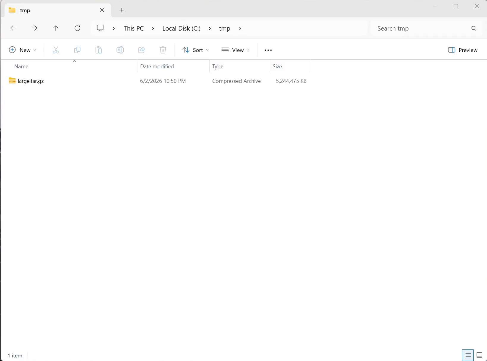

# Archive Extractor 

**A macOS-style, performant archive extractor for Windows 11/10.**



Archive Extractor is a tiny, native **Win32 (C++20)** application that brings the feel of the macOS Archive Utility to Windows. It registers itself as a file handler, so opening a supported archive is instant and just works.

## Features

- **One click.** Double-click an archive — a small centered progress dialog appears, then disappears when done.
- **Smart placement.** Extracts into a sensibly named folder, and avoids clutter when an archive already has a single top-level folder.
- **Reveal & select.** When finished, Explorer opens with the new items pre-selected.
- **Passwords.** Prompts for a password on encrypted ZIP, 7z (including header-encrypted), and RAR/RAR5.
- **Zero runtime deps.** Statically linked — no VC++ redistributable, no installer prerequisites.

### Supported formats

| Group | Formats |
|---|---|
| Containers | `.zip` &nbsp; `.7z` &nbsp; `.rar` &nbsp; `.tar` |
| Single-stream | `.gz` &nbsp; `.bz2` &nbsp; `.xz` &nbsp; `.zst` &nbsp; `.lz4` &nbsp; `.br` |
| Compound (tar) | `.tar.gz` / `.tgz` &nbsp; `.tar.bz2` / `.tbz2` &nbsp; `.tar.xz` / `.txz` &nbsp; `.tar.zst` / `.tzst` &nbsp; `.tar.lz4` |
| Multi-volume | 7z split (`.7z.001`…) &nbsp; RAR (`.partN.rar`, `.rNN`) &nbsp; spanned ZIP (`.z01`…) |

Powered by **libarchive** (zlib/bzip2/lzma/lz4/zstd/openssl), **bit7z/7z.dll** for
encrypted 7z and RAR, and **brotli** for `.br`.


## Releases

Pre-built binaries are published on the
[**Releases**](https://github.com/binbuf/archive-extractor/releases) page.

## Build from source

The repo ships a one-stop PowerShell helper, **`scripts/build.ps1`**, that sets up
the toolchain, builds, and runs the tests.

### 1. Prerequisites

- **Windows 10/11 x64**
- **Visual Studio 2022 or 2026** with the *Desktop development with C++* workload (MSVC v143+, Windows SDK, CMake ≥ 3.21, Ninja — all bundled)
- **vcpkg** — a full clone (the VS-bundled tool-only vcpkg has no ports tree):

  ```powershell
  git clone https://github.com/microsoft/vcpkg C:\vcpkg
  C:\vcpkg\bootstrap-vcpkg.bat
  setx VCPKG_ROOT C:\vcpkg
  ```

  Dependency versions are pinned by `vcpkg.json` (`builtin-baseline`), so every
  clone resolves the same versions. The first configure builds all dependencies
  from source — expect **tens of minutes**; later builds reuse the binary cache.

### 2. Build

Open **Developer PowerShell for VS** (so MSVC/CMake/Ninja are on `PATH`), then from
the repo root:

```powershell
.\scripts\build.ps1              # Debug build + tests
.\scripts\build.ps1 -Release     # Release build + tests
```

The executable lands at `build\x64-release\ArchiveExtractor.exe` (or `x64-debug`).

### 3. `build.ps1` flags

| Flag | Effect |
|---|---|
| *(none)* | Build the **Debug** config and run its test suite. |
| `-Release` | Build the **Release** config instead. |
| `-Clean` | Rebuild this config from scratch (keeps the prebuilt vcpkg deps). |
| `-Install` | After a green build, register file associations (elevated) so double-clicking an archive launches **this** build. Re-run after each rebuild to repoint. |
| `-Uninstall` | Remove the file-association registry entries (elevated), then exit. Combine with `-Release` to target the release exe. |

```powershell
.\scripts\build.ps1 -Release -Install   # build release, then make it the handler
.\scripts\build.ps1 -Uninstall          # remove file associations
```

For already-claimed types like `.zip`, set the default with the Windows picker:

```powershell
build\x64-release\ArchiveExtractor.exe --set-default <file>
```

See [`BUILD.md`](BUILD.md) for the raw CMake commands and CI notes, and
[`docs/design/`](docs/design/) for the architecture and format specs.

## Project layout

| Path | Contents |
|---|---|
| `include/archive_core/` | Public headers for the GUI-free core library. |
| `src/core/` | `archive_core` static lib — detection, extraction, layout, registration. |
| `src/app/` | `ArchiveExtractor.exe` Win32 front end + embedded manifest/icon. |
| `tests/` | GoogleTest targets wired into CTest. |
| `scripts/` | `build.ps1`, `dev-env.cmd`, test-asset generator. |
| `installer/` | WiX/MSI packaging (planned). |

## Reference

<a href="https://www.flaticon.com/free-icons/zip-file-format" title="zip file format icons">Zip file format icons created by NajmunNahar - Flaticon</a>
